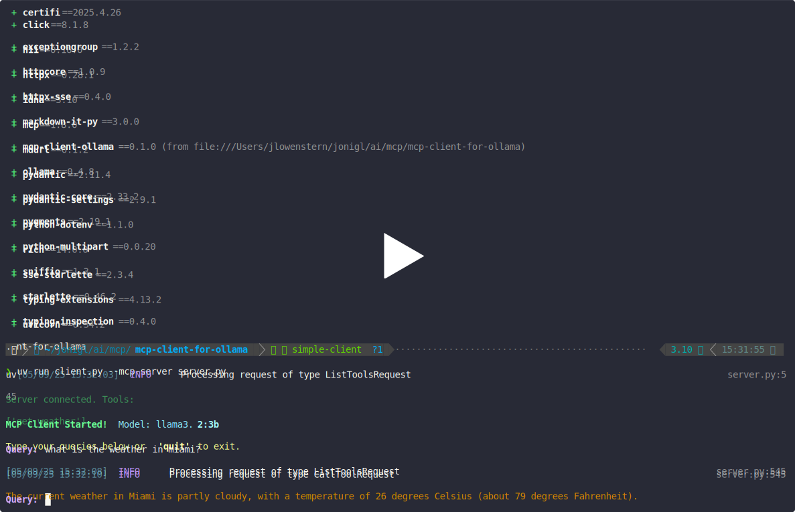

# Simple MCP Client for Ollama

A simple client implementation for interacting with Model Context Protocol (MCP) servers using Ollama models.

## Overview

This project provides a client that connects to an MCP server and uses Ollama to process queries, enabling tool use capabilities. The client establishes a connection to an MCP server, sends queries to Ollama, and handles any tool calls that the model might make.

> This branch provides an example of a simple implementation of an MCP client. For a more feature-rich and advanced version, including additional enhancements and capabilities, please refer to the [main branch](https://github.com/jonigl/mcp-client-for-ollama).

## Features

- Connect to any MCP-compliant server
- Use different Ollama models for processing
- Support for Python and JavaScript MCP servers
- Simple interactive chat interface
- Tool usage capabilities
- Easy to extend and modify for custom use cases
- Example MCP server implementation included
- Support for multiple Ollama models

## Requirements

- Python 3.10+
- Ollama running locally
  - `llama3.2:3b` (if using default model)
- UV package manager

## Installation

```bash
uv venv
source .venv/bin/activate
uv pip install .
```

## Quick Start

This command will start the client with the default `llama3.2:3b` model and connect to the included MCP server implementation.
```bash
uv run client.py --mcp-server server.py
```

## Demo

[](https://asciinema.org/a/718592)


## Usage

Run the client with:

```bash
uv run client.py --mcp-server <path_to_mcp_server> --model <ollama_model>
```

### Arguments

- `--mcp-server`: Path to the MCP server script (.py or .js)
- `--model`: Ollama model to use (default: `llama3.2:3b`)

### Examples

Using the default model (`llama3.2:3b`):
```bash
uv run client.py --mcp-server server.py
```

Using a different model:
```bash
uv run client.py --mcp-server server.py --model qwen2.5:7b
```

Using a JavaScript MCP server:
```bash
uv run client.py --mcp-server server.js --model llama3.2:3b
```

#### Server

This repository includes a sample MCP server implementation in [`server.py`](./server.py) that you can use for testing or as a reference implementation.

## Relation to Official MCP Client guide

While this project was inspired by the [official MCP client quickstart guide](https://modelcontextprotocol.io/quickstart/client), it has been adapted specifically for Ollama models rather than Anthropic models. The official guide focuses on Claude and other Anthropic models, whereas this implementation provides a similar experience but tailored for open-source models running through Ollama.

If you're looking for the official MCP implementation for Anthropic models, please refer to the official documentation.
